# Data Pipeline Lifecycle

This document provides a visual overview of the current end-to-end data
pipeline for the Market Sentiment Analysis project.

The pipeline reflects the existing implementation and follows the
lifecycle:

**Ingestion → Validation → Processed → Accumulation → EDA**

## Diagram

## Notes

- **Ingestion** pulls raw GDELT articles and daily OHLCV price data, writes canonical raw files, archives prior snapshots, and records run metadata.
- **Validation** performs read-only quality checks on raw inputs and outputs markdown reports under `docs/validation`. Validation does not mutate data.
- **Processing** produces deterministic, regenerable cleaned datasets that are overwritten on each run.
- **Accumulation** updates long-term, deduplicated datasets and associated manifests used for longitudinal analysis.
- **EDA** notebooks read from accumulated datasets for exploration and analysis and do not write back to pipeline data.

This diagram is intended to document data flow, lifecycle boundaries, and mutability guarantees. It does not introduce new architecture decisions and should remain consistent with the README and DEVELOPER documentation.
