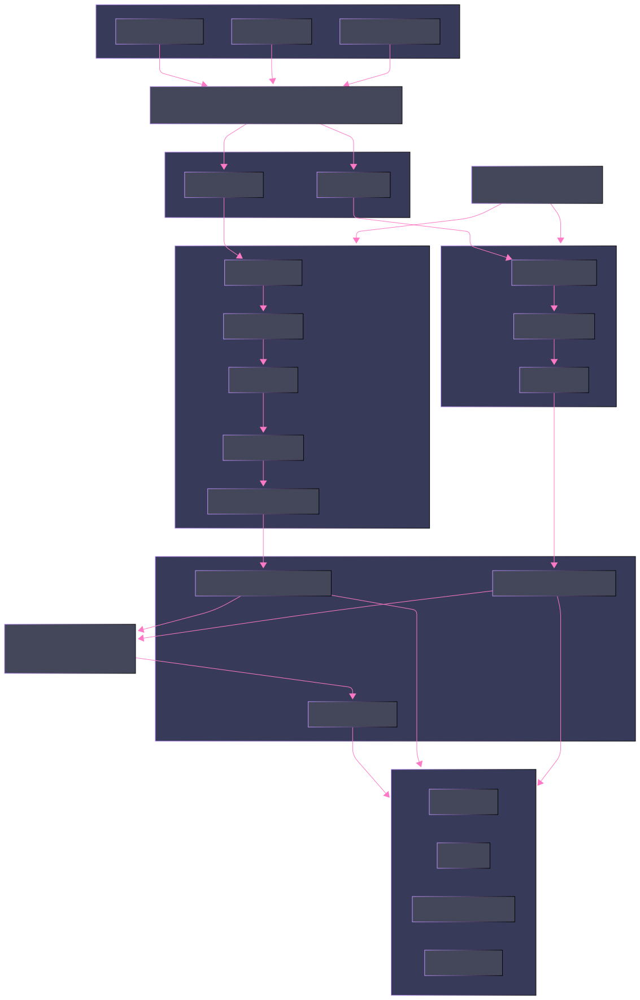

# Data Pipeline Architecture

This document provides a visual overview of the end-to-end data pipeline
for the Market Sentiment Analysis project.

The pipeline is structured around two parallel tracks that converge into a
joined dataset used for analysis:

**Ingestion → Validation → Cleaning → Accumulation → Sentiment → Join → Analysis**

## Diagram

## Pipeline Stages

- **Ingestion** (`data_ingestion.py`) pulls raw GDELT articles via the Doc 2.0 REST API (with BigQuery as a fallback when the API is rate-limited) and daily OHLCV prices for the MAG7 tickers. It archives prior canonical files and writes a run manifest under `data/raw/snapshots/`. Controlled via `RUN_INGEST=1` in the pipeline, with optional `FIXED_START_DATE`, `FIXED_END_DATE`, and `DAYS_BACK` env vars.

- **Validation** (`validate_gdelt.py`, `ohlcv_validation.py`) performs read-only quality checks on raw inputs — auditing for gaps, duplicates, and anomalies — and outputs markdown reports under `docs/validation/`. Validation never mutates data.

- **Cleaning** (`cleaning_gdelt.py`, `ohlcv_cleaning.py`) applies deterministic transformations to validated raw data: URL and headline deduplication, language and relevance filtering, column pruning, and missing value handling. Cleaned outputs are written to `data/processed/` and can always be regenerated from raw inputs.

- **Accumulation** (`accumulate.py`) merges newly cleaned data into the existing long-term accumulated datasets, deduplicates on URL (GDELT) or date + ticker (OHLCV), and sorts by date. This maintains a growing historical record across pipeline runs.

- **Sentiment** (`add_sentiment.py`, `dedupe_and_sentiment.py`) scores each GDELT article using a word-bank lexicon, then performs a final deduplication pass and regenerates sentiment across the full accumulated dataset, producing `gdelt_articles_with_sentiment.csv`.

- **Join** (`build_gdelt_ohlcv_join.py`) is run separately from the main pipeline. It aligns each article to the next trading day (t+1) using the NYSE calendar via `pandas_market_calendars`, joining sentiment signals to forward-looking OHLCV prices. Output: `gdelt_ohlcv_join.csv`.

- **Analysis** notebooks under `analysis/` read from processed outputs only and do not write back to pipeline data. The analysis layer is organized into measurement, structural, price alignment, robustness, and numbered hypothesis tests.

## Notes

- `run_pipeline.sh` orchestrates the full GDELT and OHLCV tracks but does **not** run the join step. Run `build_gdelt_ohlcv_join.py` separately when the joined dataset is needed.
- Raw files under `data/raw/` are treated as append-only and are never manually edited.
- All pipeline outputs are regenerable from committed code and canonical raw inputs.
- The pipeline requires an active Conda environment (`conda activate advds`). See `DEVELOPER.md` for setup and troubleshooting.

This diagram is intended to document data flow, lifecycle boundaries, and mutability guarantees.

